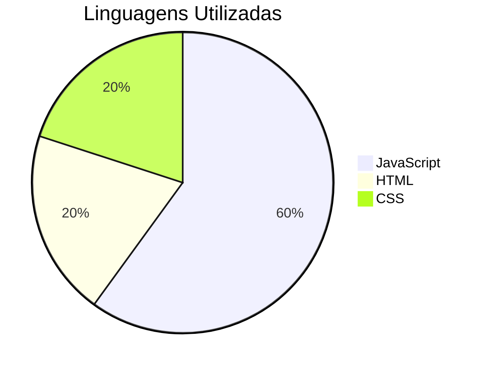
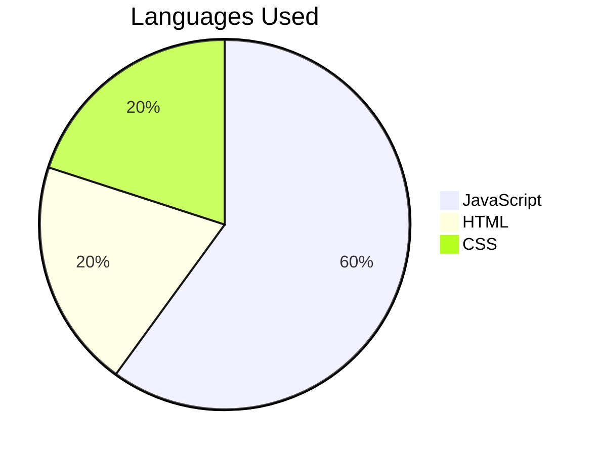

# Calculadora de Combustível

## Descrição
Este projeto é uma calculadora de combustível desenvolvida em React. Ele permite que os usuários calculem se vale a pena usar álcool ou gasolina.

## Description
This project is a fuel calculator developed in React. It allows users to calculate whether it is worth using alcohol or gasoline.

## Instalação do Vite

Para rodar este projeto, é necessário instalar o Vite. Siga os passos abaixo:

1. Certifique-se de ter o Node.js instalado em sua máquina.
2. Abra o terminal e navegue até o diretório do projeto.
3. Execute o comando `npm install` para instalar as dependências.
4. Execute o comando `npm run dev` para iniciar o servidor de desenvolvimento.

## Vite Installation

To run this project, you need to install Vite. Follow the steps below:

1. Make sure you have Node.js installed on your machine.
2. Open the terminal and navigate to the project directory.
3. Run the command `npm install` to install the dependencies.
4. Run the command `npm run dev` to start the development server.

## Tecnologias Utilizadas
- React
- TypeScript
- HTML
- CSS

## Technologies Used
- React
- TypeScript
- HTML
- CSS

## Contato
- [WhatsApp](https://wa.me/35984061841)
- [LinkedIn](https://www.linkedin.com/in/rodrigo-marques-tavares-9482b4226/)

## Contact
- [WhatsApp](https://wa.me/35984061841)
- [LinkedIn](https://www.linkedin.com/in/rodrigo-marques-tavares-9482b4226/)

## Gráfico de Linguagens Utilizadas

## Languages Used Chart

