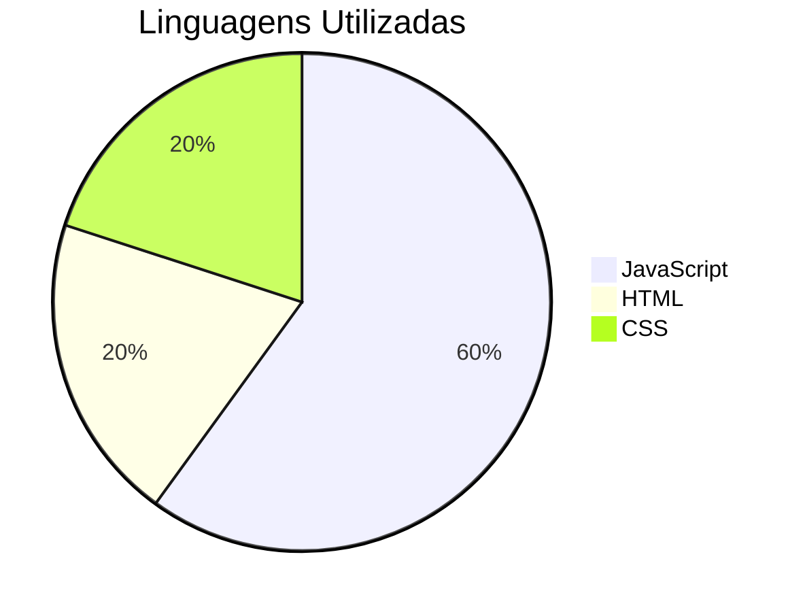
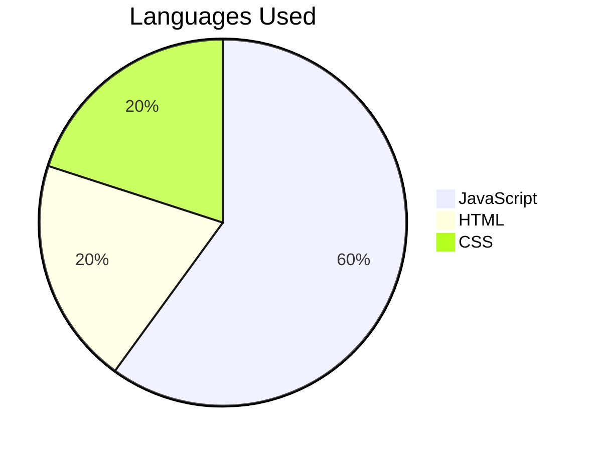

# Calculadora de Combustível

## Descrição
Este projeto é uma calculadora de combustível desenvolvida em React. Ele permite que os usuários calculem se vale a pena usar álcool ou gasolina.

## Description
This project is a fuel calculator developed in React. It allows users to calculate whether it is worth using alcohol or gasoline.

## Tecnologias Utilizadas
- React
- TypeScript
- HTML
- CSS

## Technologies Used
- React
- TypeScript
- HTML
- CSS

## Contato
- [WhatsApp](https://wa.me/35984061841)
- [LinkedIn](https://www.linkedin.com/in/rodrigo-marques-tavares-9482b4226/)

## Contact
- [WhatsApp](https://wa.me/35984061841)
- [LinkedIn](https://www.linkedin.com/in/rodrigo-marques-tavares-9482b4226/)

## Gráfico de Linguagens Utilizadas

## Languages Used Chart

